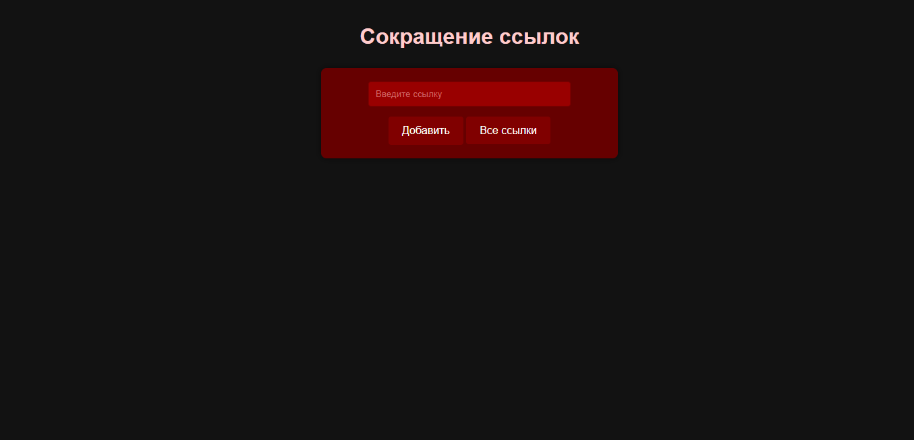
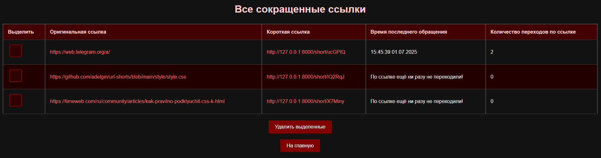
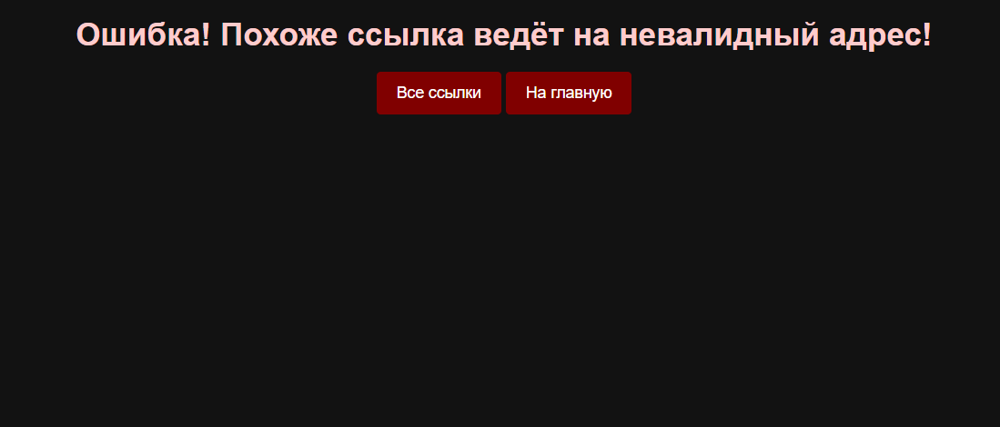

# MakeShortUrl

Проект на Symfony для создания сокращенных ссылок.
Выполнен в рамках данного тз:
```
Доработайте проект с сокращением ссылок, добавив туда работу с базой данных. Необходимо
1) Создать базу данных на sqlite с использованием конфигурации и консоли Symfony, если требуется - донастроить среду и установить Doctrine
2) Добавить сущность - ссылка, в которой хранится полная ссылка, сокращённая ссылка, дата создания, дата последнего использования и число переходов по краткой ссылке
3) Реализовать все CRUD операции для ссылок: добавление новой, удаление, получение полной ссылки по сгенерированному краткому идентификатору, изменение даты последнего обращения и счётчика использований, получение полного списка сокращённых ссылок. Написать или доработать соответствующие методы контроллера и репозитория. Метод перехода по ссылке должен увеличивать счётчик на единицу и обновлять время использования ссылки.
4) Создать все необходимые страницы: добавление новой ссылки, просмотр списка ссылок с информацией о них и кнопкой "удалить" у каждой, при нажатии на которую соответствующая ссылка будет удаляться, либо общей кнопкой и чекбоксами, чтобы можно было удалять сразу несколько ссылок
```
Всего в проекте три странички:

*(главная страница, по адресу host:port/)*

*(страница для вывода всех ссылок host:port/all)*

*(страница ошибки - выводится при неудачном переходе по короткой ссылке)*

# Итог

В рамках проекта реализован контроллер, сущность и репозиторий для работы с базой данных. Проект работает, для запуска ввести в консоли:
```bash
symfony serve
```
